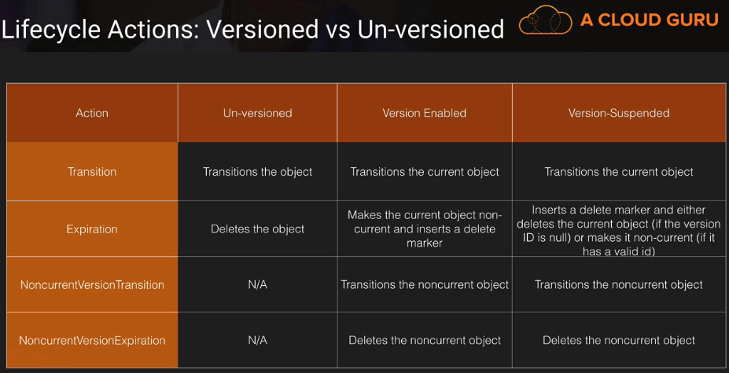

TODO: Review course to see if this repo does indeed replace the course.

# Intended Learning Strategy

This repo is a concise summary and replacement of the [S3 Masterclass](https://acloud.guru/learn/aws-lambda) tutorial by "A Cloud Guru" in February 2017.

Read this repo linearly from top to bottom. You do not need to access the above course to learn AWS Lambda. However, the course link is provided just in case you need more information about a topic.

# Chapter 2 - The Basics of S3

### S3 Basics

- __What do s3 objects consist of?__
  - Key = name of object.
  - Value = the data being stored (up to 5TB).
  - Version ID = a string of data assigned to an object when versioning is enabled.
    - Bucket + Key + Version ID uniquely identify an object in S3.
  - Metadata = name-value pairs which are used to store information about the object
  - Subresources = additional resources specifically assigned to an object.
    - Example Subresource: Access control information = Policies for controlling access to the resource.
- __What kind of file structure is S3?__ - S3 is a flat file structure. Directories are imitated by use of prefixes.
- __What kind of service is S3?__ - S3 is a RESTful web service. We interact with it over web-based protocols such as http & https. We usually interact with it using wrappers such as
  - AWS Management Console
  - AWS CLI (Command Line Interface)
  - AWS SDKs (Software Development Kits)

### Buckets and Objects Lab

- __How do you get s3 bucket metadata?__ - retrieved when doing a GET request, as part of the header.
- __What are 2 ways to categorize s3 objects__ (~21:00) can categorize files by either tags, or folders (prefixes).

# Chapter 3 - Security: Access Control

### An Introduction to S3 Permissions

- __Are s3 objects private or public by default?__ - (1:05) private.
- __What are 2 types of policies we can use to access s3 data?__ - (1:35) Resource-based policies (applied directly to a resource such as a bucket or object). User policies (applied to IAM users in your account)
- __What are 2 types of Resource-based policies?__
  1. Access Control Lists (ACL) - for AWS Accounts & Predefined Groups
  1. Bucket Policies - for AWS Accounts & IAM Users.
- __Which is newer ACL or Bucket Policies?__ - Bucket Policies mostly replace ACLs (ACL is considered legacy). However, ACL still has specific use cases.

### Access Control Lists (ACLs) Lab

- __What is a Canonical ID?__ - (~3:00) A long string that represents our AWS account. [More info](https://docs.aws.amazon.com/general/latest/gr/acct-identifiers.html)

### Bucket & User Policies Lab (Part 2)

- __What are 2 ways to give a user access to a bucket?__ (7:45)
  1. Bucket Policy (attached to Bucket)
  1. User Policy (attached to User)
- __How prevent user from uploading non-encrypted file to S3?__ - (~9:30) Use a bucket policy's "condition" (in JSON) to require encryption
- __If there's a "deny" and an "allow", which wins?__ - Deny.

### Cross Account Access Using ACL's Lab

- __Using ACL, how have AWS Account 1 give AWS Account 2's User access to Account 1's s3 bucket?__ (entire video, ~15:00)
  1. Account 1 gives Account 2 access using ACL.
  1. Account 2 gives it's user access using Bucket Policy.

### Cross Account Access Using Bucket Policies Lab

- __Using Bucket Policies, how have AWS Account 1 give AWS Account 2's User access to Account 1's s3 bucket?__ (entire video, ~15:00)
  1. Account 1 gives Account 2's _user_ access using Bucket Policy
  1. Have Account 2 give it's user ability to do general s3 putObject, etc.
- __Which method (ACL or Bucket Policy) is better for CORS?__ - Bucket Policies, as process is simpler. See slide at end of video for more info.

### Timed URL Lab

- __What's a timed URL?__ - A URL (to a resource, such as a picture for example) that's only available for a certain amount of time (such as 1 day).
- __How create timed URL? What inputs are needed__ - Can do it using Python. Need:
  1. Security Credentials
  1. Bucket Name
  1. Object Name
  1. HTTP method
  1. Expiration date & time.

# Chapter 4 - Security: Logging and Monitoring

### Monitoring S3 With CloudWatch Lab

- __What are CloudWatch Dashboards?__ - A simple place to put Cloudwatch graphs.
- __What is difference between Access logging and CloudTrail logging__ - Access logging only shows requests within your bucket, while CloudTrail logging shows API calls within all of s3.

### S3 Access Logging Lab

- __What service can analyze logs?__ - (9:15) ElasticSearch.

### CloudTrail Logging

### CloudTrail & CloudWatch Metrics Lab

### CloutTrail & CloudWatch Events Lab

- __What are CloudWatch events?__ - (5:20) Lets you respond to state changes in your AWS resources. His example: He creates a CloudWatch event that
  1. Listens to "createBucket" from CloudTrail
  1. Kicks off a Lambda function (to delete the created bucket)

# Chapter 5 - Security: Data Protection

### S3 Encryption

- __For s3, what are 2 places we should encrypt data?__ - (0:45) In transit, and at rest.
- __What are 2 types of encryption regarding keys?__ (3:10)
  1. Symmetric encryption - same key for encryption/decryption
  1. Asymmetric encryption - 2 keys. 1 public key for encryption. 1 private key for decryption.

- __What are 3 types of server-side encryption?__
  1. SSE-S3. s3 handles all keys for you. Each object is encrypted with a unique data key.
  1. SSE-KMS. keys can be used across AWS Services (not just s3). Not free.
  1. SSE-C - we provide the keys
- __What is client-side encryption?__ (13:35) - It's when you encrypt your data on the client. We can then upload that encrypted data to s3 (so in this case, server-side encryption isn't needed).

### S3 Encryption Lab

- __Are s3 objects accessible by HTTP or HTTPS by default?__ - (16:50) both HTTP and HTTPS. (Rodney: But near end of tutorial I think I learned static websites hosted on s3 are HTTP only, unless you use CloudFront for HTTPS)
- __How enforce encryption in transit? (example: forcing uploads to s3 to be HTTPS?)__ (~18:00) use a bucket policy. I think HTTPS does encryption in transit for you.

### Cross Region Replication

- __What is cross-region replication?__ - When we replicate our s3 data to another AWS region.
- __Name 2 reasons to do cross-region replication__ - (1:45) Latency decrease, disaster recovery
- __How does encryption affect cross-region replication?__ - (4:00) SSE-KMS encrypted files can't be transferred (since SSE-KMS is region-based). SSE-C files can't be transferred either since AWS doesn't know how to decrypt them.
- __When enabling cross-region replication, does it copy over everything to destination region?__ - (7:25) No. Any objects created before enabling cross-region replication are not actually replicated
- __Does deleting a version of a file in source bucket also delete it in destination bucket?__ - (10:30) No. (12:10) s3 does not delete it in destination to help you protect your data (disaster recovery)

# Chapter 6 - Lifecycle Management

### Lifecycle Management

- __What is Lifecycle Management?__ - It's automating the image below.

- __How have versioning for 2 months__ - (12:35) Use "Versioning" combined with "Lifecycle Management"

### Storage Class Analysis

- __What is Storage Class Analysis?__ - (whole video, 12:55) a service that tells you how much of your data is infrequently accessed.

# Chapter 7 - Event Notifications

### Event Notifications

- __What is an example of an Event Notification__ - Adding a new object to s3 is an example event. A notification configuration in the bucket can publish events to a destination.

- __Where are 2 places you can add trigger for s3 to send event notification to Lambda?__ - (8:20) in Lambda, or (12:40) in s3.

# Chapter 8 - Performance Optimization

### An Introduction to CloudFront

__What are 5 things that can serve as CloudFront origin?__ (7:05) s3 bucket, EC2 instance (that may have a web server), Elastic Load Balancer (that may front an EC2 instance or Route53 endpoint), Route 53 endpoint, or an external system.

### Transfer Acceleration

- __For selecting region for s3, it should be close to what 2 things?__ (0:45) proximity to users, and proximity to our AWS resources (such as our EC2 instances)
- __Is transfer acceleration same as CloudFront?__ - (5:00) No. It just uses the CloudFront network. So, there is no caching, and we're not creating a CloudFront distribution.

### Transfer Acceleration Lab

- __After enabling transfer acceleration, how do u use it?__ - (1:10) You're given a new (URL) endpoint that you can use for GET/PUT requests.

### Choosing an S3 Naming Scheme

- __Why does name of keys (filenames) in s3 matter?__ - (My summary) s3 hashes them and puts them in partitions. If all your filenames start the same (such as 2019-), then they will all get hashed to the same partition, and it will cause s3 to slow down.
- __What are 3 ways to solve above problem?__
  1. Can hash the file names. (i hate it, ruins filenames)
  1. Use a short hash to prepend the name (2nd least hated solution)
  1. Can use prefixes (folders) and put files in there. (my least hated solution)

### Optimizing S3 PUTS, GETS, & LISTS

- __How optimize PUTS, GETS, LISTS?__ - see image below.

# Chapter 9 - Website Hosting

### Static Website Hosting

- __How make DYNAMIC website with s3?__ - (~2:20) Static content on s3. API Gateway will call Lambda functions for dynamic stuff.
- __How do HTTPS with static website?__ - (6:00) Put CloudFront in front of website. Users will use CloudFront as https, and CloudFront will talk to origin using HTTP.

### Static Website Hosting Lab

- __How do redirects?__ - (7:10) in s3 console under "Static Website Hosting", we can write XML code for redirects.

### Cross-Origin Resource Sharing (CORS) Lab

- __How enable CORS for s3 bucket__ - (10:15) Simple. Go to s3 bucket that we're trying to get data from, click Permissions -> CORS, and add a bucket policy (with custom code).

# Chapter 10 - Practical Uses of S3

skip this chapter - just shows how to use a specific non-AWS tool (CloudBerry).

# References

Repo is based on [S3 Masterclass](https://acloud.guru/learn/aws-lambda) tutorial by "A Cloud Guru" in February 2017 - An amazing course. The encryption part of this course was excellent!
