<p align="center">
    
</p>

This repo is a concise summary and replacement of the [S3 Masterclass](https://acloud.guru/learn/s3-masterclass) tutorial by _A Cloud Guru_.

- [The Basics of S3](#Chapter-2---the-basics-of-s3)
- [Security: Access Control](#Chapter-3---security-access-control)
- [Security: Logging and Monitoring](#Chapter-4---security-logging-and-monitoring)
- [Security: Data Protection](#Chapter-5---security-data-protection)
- [Lifecycle Management](#Chapter-6---lifecycle-management)
- [Event Notifications](#Chapter-7---event-notifications)
- [Performance Optimization](#Chapter-8---performance-optimization)
- [Website Hosting](#Chapter-9---website-hosting)
- [Custom Static Website Creation](#custom-static-website-creation)

# Chapter 2 - The Basics of S3

### S3 Basics

- __Do buckets have regions?__ (5:30) Yes. A bucket must be created in a specific region.
- __What type of namespace does s3 have?__ (5:45) a global namespace. Bucket names must be unique globally (across everybody's accounts) regardless of the region they're created in.
- __How can you access a bucket?__ (6:25) Use a URL. See image below


- __What do s3 objects consist of?__ (8:40)
  - Key = name of object.
  - Value = the data being stored (up to 5TB).
  - Version ID = a string of data assigned to an object when versioning is enabled.
    - Bucket + Key + Version ID uniquely identify an object in S3.
  - Metadata = name-value pairs which are used to store information about the object
  - Subresources = additional resources specifically assigned to an object.
    - Example Subresource: Access Control Lists (ACLs)
- __What kind of file structure is S3?__ (9:55) S3 is a flat file structure. Directories are imitated by use of "prefixes".
  - For example, `http://acloudguru.s3.amazonaws.com/images/thumbnails/public/me.jpg` has `http://acloudguru.s3.amazonaws.com` as the bucket url, and `images/thumbnails/public/me.jpg` as the object key. The `images/thumbnails/public/` part are the nested prefixes.
- __What is object tagging?__ (12:10) Lets you categorize objects by key/value tags, such as `Project = acloudguru`
- __What is s3's consistency model?__ (13:25)
  - _read-after-write consistency_ for "puts of new objects": . Data can only be read after its been successfully written to all physical facilities and returns success.
  - _eventual consistency_ for "overwrite puts" (updates, deletes). This is done to provide a lower latency and high throughput.
- __Does s3 lock objects while writing to them?__ (14:50) No. If 2 requests are made at about the same time, the one with the latest timestamp wins
- __Does s3 have cross-region replication?__ (15:40) Yes, it's optional
- __Does s3 have versioning?__ (15:55) Yes, if enabled, it provides the ability to retrieve every version of every object ever stored in s3, even if the object is deleted.
- __What security features does s3 have?__ (16:15)
  - _access_: only the bucket and object owners have access by default. Permissions to objects and buckets can be granted using "policies"
  - _encryption_: data can be encrypted at rest, and in transit.
  - _audit trails_: all access to s3 resources can optionally be logged to provide audit trails
- __What kind of service is S3?__ (16:50) S3 is a RESTful web service. We can interact with it over web-based protocols such as http & https. Instead of directly using the REST API, we usually interact with it using wrappers such as
  - AWS Management Console
  - AWS CLI (Command Line Interface)
  - AWS SDKs (Software Development Kits)

### Object Storage classes

- __What types of storage classes does s3 have?__ (1:00)
  - _Standard_ - millisecond access to data.
  - _Standard Infrequent Access_ - lower fee than _Standard_, but you're charged a retrieval/revival fee. You still have millisecond access to data. A good example is storing "backup data" in this storage class.
  - _One Zone Infrequent Access_ - same as _Standard Infrequent Access_, but cheaper since it's stored in only 1 availability zone.
  - _Glacier_ - designed for archived data. Data is not available in real-time. Restoring data takes between minutes (more expensive) and hours (less expensive). Minimum storage duration is 90 days, so even if you store your object for 1 day, you're billed for 90 days.
  - _Glacier Deep Archive_ - Same as Glacier, but slower and less expensive. Restoring data takes hours. Minimum storage duration is 180 days.
  - _Intelligent Tiering_ - Automatically moves data between tiers. This storage class is useful if you're unsure how often you'll want to access the data.
  - [List of storage classes](https://aws.amazon.com/s3/storage-classes)
- __What are "Lifecycle Policies?"__ (9:40) An s3 feature that allows objects to transition between storage classes based on predefined days (such as 30 or 60 days). Can be applied to an entire bucket or group of objects.

### Buckets and Objects Lab

- __How do you retrieve s3 bucket custom metadata that you created?__ (17:40) Custom metadata you've created can be retrieved when doing a GET request, as part of the header.
- __What are 2 ways to categorize s3 objects?__ (18:00) can categorize files either with "prefixes" (which are like folders), or tags


# Chapter 3 - Security: Access Control

### An Introduction to S3 Permissions

- __Are s3 objects private or public by default?__ (1:15) private.
- __What are 2 categories of policies we can use to access s3 data?__ (1:35)
   - _Resource-based policies_ - applied directly to a resource such as a bucket or object.
     1. Access Control Lists (ACLs) - for AWS Accounts & Predefined Groups
     1. Bucket policies - for AWS Accounts & IAM Users. Bucket policies mostly replace ACLs (ACLs are considered legacy).
   - _User policies_ - applied to IAM users, groups, or roles in your account
- __How can you give access to a user in a different AWS account?__ (5:30)
  1. Account A uses a _bucket policy_ to give Account B access.
  1. Account B delegates permissions to a user in its own account via a _User Policy_
  1. User in Account B can now access to Account A's s3 bucket
- __If one policy grants access, and another denies access, who wins?__ (8:00) deny wins.

User and bucket in same AWS account:


User and bucket in different AWS accounts:


User in different AWS account than bucket or object:

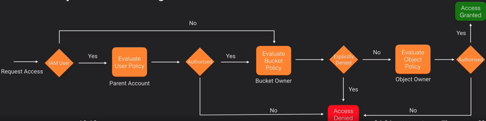

- __What are 3 things ACLs can do that bucket policies can't do, or can't do well?__ (12:55)
  - If a bucket has objects that are not owned by the bucket owner, then the bucket owner can't apply a bucket policy that applies to that object. The object's owner would need to use an ACL to manage access to that object.
  - Having different access for individual objects in a bucket. It's easier to do this with an ACL than a bucket policy.
  - Grant access to the _Predefined Group_ of "S3 Log Delivery Group" on a bucket, so s3 can write access logs to a bucket.
- __What must a bucket policy be used for, that an ACL can't do?__ (14:50) use a bucket policy when granting permissions more complex than ACL's basic read/write permissions.

### Access Control Lists (ACLs) Lab

- __What permissions do a bucket and object get when created?__ (0:50) just an ACL with full permissions for the resource owner. No bucket policies or user policies are created.
- __Can an ACL give access to an IAM user?__ (1:40) No. It can only give access to AWS accounts and "Predefined Groups".
- __What kind of permissions do ACLs give?__ (1:50) Only basic read/write permissions.
- __What is a Canonical ID?__ (3:00) [A long string that represents our AWS account](https://docs.aws.amazon.com/general/latest/gr/acct-identifiers.html)
- __What types of ACL permissions are there?__ (4:40) see image below


- __What are ACL "Predefined Groups"?__ (6:15) groups with a URI you can use to represent them:
  - _Authenticated Users_
  - _All Users_
  - _S3 Log Delivery Group_
- __What are canned ACLs?__ (7:40) predefined grants of permissions:


### Bucket & User Policies

- __What are 2 ways to give a user access to a bucket?__ (0:35)
  1. Bucket Policy (attached to Bucket)
  1. User Policy (attached to User)
- __What 5 elements do bucket policies have?__ (2:30)
  - _Principal_ - the account or user that is allowed access to the actions and resources specified in the statement
  - _Effect_ - "allow" or "deny"
  - _Action_ - list of permissions to allow or deny
  - _Resource_ - the bucket or object for which access applies to. Specified as Amazon Resource Name (ARN).
  - _SID_ - not required for S3. Generally used as a description of the policy statement
- __Which of the 5 elements above is not needed for User Policies?__ (3:35)_Principal_ is not needed since the policy applies to the user
- __What's a "conditional" in a bucket policy?__ (10:05) similar to an `if` statement, that lets us do things like
  - allow a user to delete an object only if they use multi-factor authentication.
  - allow a user to "put" an object only if the object is uploaded with a "public-read" canned ACL granted (as done in policy below).

```json
{
  "Version" : "2012-10-17",
  "Statement" : [
    {
      "Sid": "AllowPutObjects",
      "Principal" : {
        "AWS" : "arn:aws:iam::123456789012:user/Steve"
      },
      "Effect" : "Allow",
      "Action" : [
        "s3:PutObject"
      ],
      "Resource" : [
        "arn:aws:s3:::stevespublicbucket/*"
      ],
      "Condition" : {
        "StringEquals" : {
          "s3:x-amz-acl" : [
            "public-read"
          ]
        }
      }
    }
  ]
}
```

### Bucket & User Policies Lab (Part 2)

- __How can you prevent a user from uploading non-encrypted file to S3?__ (8:15) Use a bucket policy with a "conditional" (in JSON) to require encryption

### Cross Account Access Using ACL's Lab

- __If AWS Account A gives AWS Account B access to its s3 buckets, how does Account B access the buckets?__ (2:15) the buckets won't magically show up in Account B's s3 dashboard. Account B must access Account A's buckets by using the command line.
- __Using an ACL, how can Account A give Account B's user access to Account A's s3 bucket?__ (entire video)
  1. (6:35) Account A gives _entire_ Account B "read" access using an ACL (since ACLs cant give access to just one user in Account B)
  1. (11:35) Account B gives its user `s3:ListBucket` access using a User Policy.

### Cross Account Access Using Bucket Policies Lab

- __Using bucket policies, how can Account A give Account B's user access to Account A's s3 bucket?__
  1. (2:00) Account A can give a _specific user_ in Account B "read" access using a bucket policy.
  1. (5:50 - 6:15) Account B gives its user "s3:ListBucket" access using a User Policy
- __How can Account A enforce user in Account B to upload files to Account A's s3 bucket with `bucket-owner-full-control`?__ (2:35) You can use a "conditional" in the bucket policy (which is not possible with ACLs)

### Cross Account Access (Additional Notes)

I actually tried the ACL method, and bucket policy method, and neither worked. I had to do both together for cross-account access to work.

### Timed URL Lab

- __What's a timed URL?__ (0:25) A URL (to a resource, such as a picture for example) that's only available for a certain amount of time (such as 1 day).
- __How create a timed URL? What inputs are needed?__ (1:55) Can do it programatically (Python works). Need:
  1. AWS Security Credentials
  1. Bucket Name
  1. Object Name
  1. HTTP method (like GET or PUT)
  1. Expiration date & time.


# Chapter 4 - Security: Logging and Monitoring

### Monitoring S3 With CloudWatch

- __What is CloudWatch?__ (0:20) A monitoring tool for AWS services. It can track metrics, collect log files, set alarms, etc.

### Monitoring S3 With CloudWatch Lab

- __What metrics come by default with s3 buckets?__ (1:00) storage metrics. They're updated once every 24 hours.
- __What metrics must you enable by paying?__ (1:20) "Requests", and "data transfer" metrics. They're updated in 1 minute intervals.
- __What are CloudWatch Dashboards?__ (7:50) A simple place to put Cloudwatch graphs.
- __What kind of alerting/alarms are there for s3?__ (9:35) For a metric, you can set an alarm on it that emails someone when the alarm is triggered. These are just standard CloudWatch alarms for s3.

### S3 Access Logging

- __What is "s3 access logging?"__ (0:00) it tracks requests for access to a bucket. It records access time, requestor IP, object key name, operation type, response codes, etc.
- __Is bucket access logging enabled or disabled by default?__ (0:40) disabled by default.
- __Are logs real-time?__ (1:05) No. Logs are periodically delivered. They're collected, consolidated, and then delivered.
- __Where are s3 access logs saved?__ (1:30) to a target bucket you specify. Using a different bucket is usually a good idea for organizational purposes.
- __Why enable s3 access logging?__ (3:20) for security and audit reasons, to help understand AWS bill, or to learn about customers.
- __What should you do if logs build up over time?__ (4:05) use lifecycle rules to archive or delete logs after a period of time.
- __What is difference between S3 access logging and CloudTrail logging?__ (5:05) Access logging only shows requests within your bucket, while CloudTrail logging shows API calls in all of s3.

### S3 Access Logging Lab

- __What service can analyze logs?__ (9:15) ElasticSearch.

### CloudTrail Logging

- __What is CloudTrail?__ (0:00) tracks user activity by recording API calls made to your AWS account. Can record name of API call, identity of caller, time of API call, request parameters, and response elements returned by the AWS service.
- __Where are CloudTrail logs written?__ (4:35) an s3 bucket.


### CloudTrail Logging Lab

- __Is CloudTrail enabled by default?__ (0:40) Yes, it's enabled by default in all regions, but it only saves 90 days worth of data in the CloudTrail console.
- __What's a CloudTrail "trail"?__ (3:20) with the default CloudTrail settings, you can't do any event monitoring, can't trigger alerts, can't store data for more than 90 days, etc. You need to create a "trail" that will enable logging of CloudTrail to s3, and it will let you have advanced configuration options.
- __Why send CloudTrail logs to CloudWatch?__ (9:50) this will enable you to do basic filtering and monitoring on those logs.

### CloudTrail & CloudWatch Metrics Lab

- __Assume CloudTrail wrote access logs to s3 and CloudWatch. How can you set an alarm that detects bucket creation`?__
  1. (3:15) In `CloudWatch -> Logs`, for the CloudTrail log group, use a "filter pattern" of `{ ($.eventSource = s3.amazonaws.com) && ($.eventName = CreateBucket) }` to filter for logs that create a bucket.
  1. (4:10) On the metric filter you just created, click `Create Alarm`. When the alarm triggers, it will send a notification to an SNS topic or email.

### CloudTrail & CloudWatch Events Lab

- __What are CloudWatch events?__ (5:05) A feature that lets you respond to state changes in your AWS resources.
  - Create a "CloudWatch event" by providing:
    - `Service Name: S3`
    - `Event Type: Bucket Level Operations`
    - `Specific operation(s): CreateBucket`
  - Create a "CloudWatch Rule" that will tie the "CloudWatch Event" to a Lambda function (that will delete the created bucket).

Instead of `CloudTrail -> action in S3 -> CloudWatch -> SNS`, "Chapter 7 - Event Notifications" will show the simpler workflow of `action in S3 -> SNS`

# Chapter 5 - Security: Data Protection

### S3 Encryption

- __For s3, what are 2 places we should encrypt data?__ (0:30) In transit, and at rest.
- __What is "Plaintext"?__ (1:35) unencrypted data.
- __What is "Ciphertext"?__ (1:50) the output of an encryption algorithm. It's your file in encrypted format. It's unreadable without knowledge of the algorithm and secret key.
- __What's an encryption algorithm?__ (2:20) step-by-step instructions that precisely specify how plaintext is converted to ciphertext. A secret key is needed.
- __What are 2 types of encryption regarding keys?__ (3:10)
  1. Symmetric encryption - same key for encryption & decryption
  1. Asymmetric encryption - 2 keys. 1 public key for encryption. 1 private key for decryption.
- __Along with ciphertext data, what is stored in s3?__ (3:45) An "encrypted data key"
- __What is an "encrypted data key"?__ (4:45) See image below. It's a "Symmetric Data Key" that's encrypted using a "Master Key".
- __How do you decrypt the data in s3?__ (5:15) Do the encryption steps backwards to decrypt:
  - Take the "Master Key" and use it to decrypt the "Encrypted Data Key" to get the "Symmetric Data Key"
  - Use the "Symmetric Data Key" on the "Ciphertext" to convert it back into "Plaintext"


- __How does server-side encryption for s3 work?__ (7:00) s3 encrypts your data before writing it to disk, and decrypts it when your data is read from disk.
- __What are 3 types of server-side encryption?__ See images below
  - _SSE-S3_ - Free. s3 handles all keys (Data Key, Master Key) for you using AES-256 encryption
    - Each object is encrypted with a unique data key.
    - The data key is encrypted by a master key
    - Master key is automatically rotated monthly
  - _SSE-KMS_ - Not free. Keys are managed in AWS Key Management Service (KMS) with a lot more control, outside of s3.
    - Not free.
    - Keys can be used across AWS Services (not just s3).
    - User creates, controls, and rotates master keys.
    - Uses AES-256 encryption
    - Every use of KMS is logged in CloudTrail (unlike SSE-S3 keys)
  - _SSE-C_ - Free. You (the customer) provide the keys. Encryption is AES-256. You must use HTTPS to upload objects.
    - The symmetric key is upload with the data
    - s3 encrypts the data with the key, then deletes the key
    - to decrypt the data, you must supply the key again

SSE-S3 or SSE-KMS:


SSE-C:


- __What is client-side encryption?__ (13:15) - It's when you encrypt your data on the client, then upload that encrypted data to s3. In this case, server-side encryption isn't needed.

You can keep track of your keys yourself:


Or you can have KMS supply the keys (you get the keys using the AWS SDK to make an API call to KMS):


- __What are 2 ways to encrypt data in transit?__ (16:25)
  - (16:40) For uploading to s3, use client-side encryption, so data is encrypted before upload
  - (17:00) For both uploading and getting data from s3, you can use SSL (HTTPS). You can  enforce HTTPS (instead of HTTP) using a bucket policy.
- __What is difference between HTTP and HTTPS?__ (17:10) HTTP is unencrypted. HTTPS is encrypted using assymetric encryption (public/private keys)
- __Are objects in s3 accessible by HTTP or HTTPS?__ - (17:20) both, by default.

### Server Side Encryption with KMS Managed Keys Lab

- __How does KMS encryption work?__ (0:15)
  1. Create a Customer Master Key in KMS
  1. Call KMS to get that key in 2 versions: Plaintext, Encrypted
  1. Use the Plaintext Data Key to encrypt the PlainText into CipherText
  1. Store the Ciphertext and Encrypted Data Key, both in the s3 bucket.


- __How does KMS decryption work?__ (1:56)
  1. Retrieve the encrypted key from the s3 bucket.
  1. Make a call to KMS to decrypt that data key to get the "Plaintext Data Key"
  1. Use the "Plaintext Data Key" to convert the CipherText to Plaintext

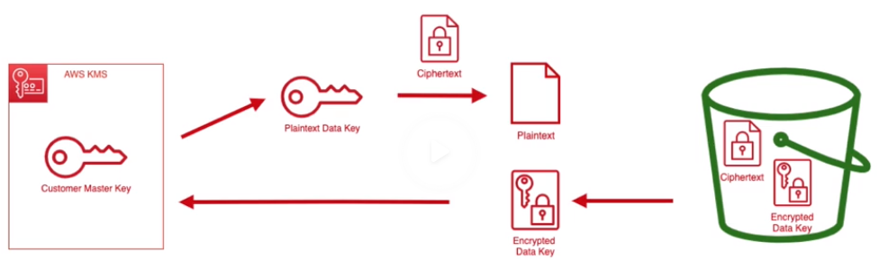


- __What are two types of "Customer Master Keys?"__ (3:05)
  1. Customer Managed - Not free. You get much more control over your key
  1. AWS Managed - Free, generated for you.
- __Are KMS keys region specific or global?__ (8:15) Region specific.
- __What are 2 reasons somebody would use a Customer Managed key?__ (9:50)
  1. It lets you set the key's bucket policy
  1. You can set a custom rotation schedule

### Server Side Encryption with Customer-Provided Keys Lab

- __For Customer-Provided keys, for encryption & decryption, do you use AWS Console, CLI, or both?__ (0:20) You must use the CLI. You can't do it through the AWS Console

### Versioning

- __Is s3 versioning enabled or disabled by default?__ (0:45) disabled by default.
- __Why wouldn't you enable versioning?__ (1:20) versioning can greatly increase storage costs
- __How can you mitigate the versioning cost?__ (1:40) use lifecycle management to archive or delete old versions of data
- __How can you make it harder for a hacker in your account from turning versioning off and deleting all files?__ (2:10) Use "Multi-factor Authentication (MFA) Delete", which can only be enabled by the root user. This only allows users that are Multi-factor authenticated to be able to:
  1. change the versioning state
  2. permanently delete an object version.
- __(In an s3 bucket with versioning enabled), how are versions of an object stored?__ (5:00) Each version of the object will have a unique "version id". The most recent version id is labeled as the current version.
- __(In an s3 bucket with versioning enabled), how does deleting versioned objects work?__ (7:40) The object is not deleted. A "delete marker" with it's own "version id" is saved to s3.
- __(In an s3 bucket with versioning enabled), how do you restore an old version of an object?__ (9:50)
  1. Can delete specific newer versions of an object (which is a permanent delete that cannot be undone) until you get the version you want, or
  1. Download the old version (`111111` in image below) and upload it (`131313` in image below). This will save the entire version history.


- __How can you stop versioning?__ (11:20) Once turned on, versioning cannot be turned off, it can only be _suspended_. That means all previous versions of an object still remain in s3. All new objects are added to s3 with a "version id" of null.


### Cross Region Replication

- __What is cross-region replication in s3?__ (0:10) When we copy our s3 data asynchronously to a bucket in another AWS region. A bucket-level feature.
- __Name 2 benefits of cross-region replication?__ (0:50) Latency decrease, disaster recovery
- __What's 1 thing you can change for the copies that are made?__ (2:20) You can change the storage class in the destination bucket to use reduced redundancy.
- __When replicating data, does the bucket have to be in the same AWS account?__ (2:50) No.
- __When enabling cross-region replication, does it copy over everything to destination region?__ (3:10) No. Any objects created before enabling cross-region replication are not actually replicated
- __What objects won't be replicated?__ (3:40)
  - Objects that you don't have permission to read
  - objects encrypted with SSE-KMS (since these keys are in a per region basis)
  - objects encrypted with SSE-C
    - If we wanted replication to work for encrypted objects, use SSE-S3 encryption
  - (5:30) objects that are already a replica
  - (6:00) [Subresource changes](https://docs.aws.amazon.com/AmazonS3/latest/dev/ObjectAndSoubResource.html) such as ACL lists are not replicated. This lets you have objects with different configurations
- __What property of objects are not replicated during replication?__ (5:15) Automated lifecycle actions
- __What are the requirements for cross-region replication?__ (6:20)
  - source & destination buckets must be version enabled
  - source & destination buckets must in different AWS regions
  - s3 must have permissions to replicate to the destination bucket.
  - can only replicate to a single destination bucket.
- __In a versioned, replicated bucket, when you delete an object in a source bucket, what happens to the object in the destination bucket?__ (7:10) both source and destination get a "delete marker". The file is still there in both.
- __In a versioned, replicated bucket, when you delete a SPECIFIC VERSION of an object in a source bucket, what happens to the object in the destination bucket?__ (7:30) s3 does not delete it in destination to help you protect your data (disaster recovery). This is especially useful against hackers.


# Chapter 6 - Lifecycle Management

### Lifecycle Management

- __What is Lifecycle Management?__ (0:00) An s3 feature that lets you specify rules that define the storage classes used throughout an object's lifecycle. It's automating the image below, for s3 buckets or objects, to save money.

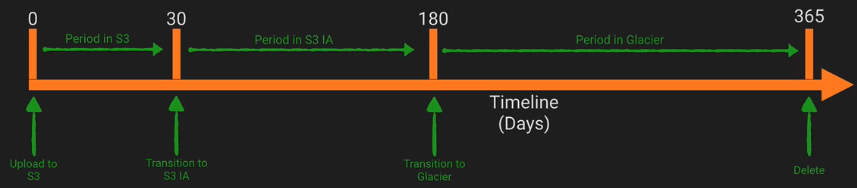

- __What kind of buckets prohibit you from setting up lifecycle rules?__ (5:45) MFA-enabled buckets
- __What is minimum days storage in certain storage classes before transitioning storage class?__ (4:50)
  - 30+ days for STANDARD before transitioning to STANDARD_IA or ONEZONE_IA.
  - 30+ days for STANDARD_IA, ONEZONE_IA, INTELLIGENT_TIERING before transitioning to Glacier
- __What is minimum size of object that's allowed to be transitioned?__ (5:25) Objects smaller than 128Kb cannot be transitioned to STANDARD_IA, ONEZONE_IA, or INTELLIGENT_TIERING.
- __If an object goes from s3 to Glacier, how do you view it?__ (6:20) Transitioned objects remain in s3 and are NOT accessible by Amazon S3 Glacier Service. You have to access the objects through s3.
- __Why is it a bad idea to store lots of small files in Glacier?__ (8:15) 40Kb of extra storage is added in order to hold the object name, index detail and metadata. This can add to cost.
- __Can you transition non-current versions only?__ (10:00) Yes. Use `NoncurrentVersionTransition` action. See image below:


- __How can you keep just last 2 months of versioned data?__ (14:20) Use "Versioning" combined with "Lifecycle Management"

### Lifecycle Management Lab

- __How can you mitigate the cost added from the 40Kb for each small file sent to Glacier?__ (19:30) one solution is to combine a bunch of the files into a single ZIP file before sending it to Glacier.

### Storage Class Analysis

- __What is Storage Class Analysis?__ (0:20) an old feature in s3 that, on a bucket/prefix/tags/etc. runs for 30+ days, then gives you detailed charts of how frequently that data is being accessed. It will also make a recommendation for you for which storage tier to use.
  - I prefer the new `INTELLIGENT_TIERING` storage class to automatically move data around storage classes for me, instead of just getting recommendations from "Storage Class Analysis" and spending time analyzing them.


# Chapter 7 - Event Notifications

### Event Notifications

- __What is an example of an Event Notification?__ (0:10) Adding a new object to s3 is an example event. A notification configuration in the bucket can publish events to a destination.
- __What's the difference between these event notifications, and the CloudTrail -> S3 -> CloudWatch -> SNS flow we saw in Chapter 4?__ (1:15) these event notifications are a bucket-level feature and are near real-time. The CloudTrail flow was for the whole of s3.

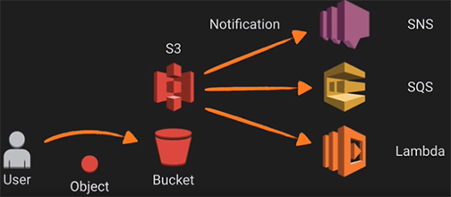

### Event Notifications Lab

- __Where are 2 locations you can add the trigger for s3 to send event notification to Lambda?__
  - (8:20) in Lambda (preferred), or
  - (12:10) in s3.


# Chapter 8 - Performance Optimization

### S3 Performance Optimisation

- __What are s3's performance numbers?__ (0:25) _per prefix_, s3 has
  - At least 3500 PUT/COPY/POST/DELETE requests per second, and
  - At least 5500 GET/HEAD requests per second
- __How can you scale s3's performance?__ (1:00) Since requests are _per prefix_, you can scale out horizontally by using more prefixes. You can download from 5 prefixes in parallel to get 5500 * 5=27500 requests per second.

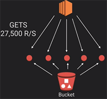

- __What if you can't get 27,500 requests/second due to EC2?__ (2:25) Add another EC2 instance (see image below)


- __How can you minimize s3 latency?__ (3:55) Place s3 buckets near AWS services (such as an EC2 that it's interacting with), or near end users.
- __How can you minimize s3 latency if your users are global?__ (5:10) If we have global users, using a particular region doesn't give much of an advantage. Use "Transfer Acceleration" to reduce latency to s3 over large distances.
- __How can you scale horizontally if forced to use 1 prefix?__ (7:30) Since s3 is not a single endpoint, you can still upload/download in a multithreaded way.
  - (8:10) For PUTS, use Multi-part upload. Can split an object into 10 pieces and upload the pieces in parallel.
  - (8:35) For GETS, use Range-based GETS. Can split the object into 10 pieces and download 10 different pieces of it in parallel.
  - (8:55) For LISTS (that list objects in a bucket), you have 3 options
    1. You can parallelize the lists by making multiple requests at the same time (such as one LIST for JPG, and one for MP4)
    1. Instead of directly querying s3, can store a secondary index of the object (such as on metadata or timestamp column) in DynamoDB, RDS, ElasticSearch/CloudSearch, or a database on EC2. Then your queries will have a faster query time than the s3 LIST command. (unsure how this would actually work)
    1. Can use "S3 Storage Inventory" to retrieve a list of your s3 objects daily or weekly and store them in a CSV file. Instead of running a LIST command, you can just download that CSV file. (Demoed in "S3 Inventory Lab" section)
- __How else can you minimize latency?__
  - (5:20) Cache frequently accessed content, using a Content Delivery Network such as CloudFront. This CDN in front of s3 will cache the content at an "edge location" that sits close to your users.
  - (6:00) Use an in-memory cache such as AWS Elasticache (TODO: find out what this is)
  - (6:10) Use AWS Elemental MediaStore to cache video content
  - (6:25) Implement retries with exponential backoff in case you're getting "503 - Service Unavailable" errors due to making lots of requests.
  - (10:00) Use latest SDKs and CLIs (since they are usually faster)
  - (10:40) Be aware of KMS Key Limits, as you may hit KMS throttling prior to s3 throttling

### An Introduction to CloudFront

- __What is CloudFront?__ (0:35) a global Content Delivery Network (CDN) service that accelerates delivery of your websites, APIs, video content or other web assets.
- __How does CDN reduce Latency?__ (1:10) See image below. The first time a user accesses the edge location in Sydney, there is no speed increase, as the file has to be downloaded from Virginia first. The next time any user needs that same data, that data will be sitting & cached in Sydney, and since it's closer to the user, it can be downloaded faster.

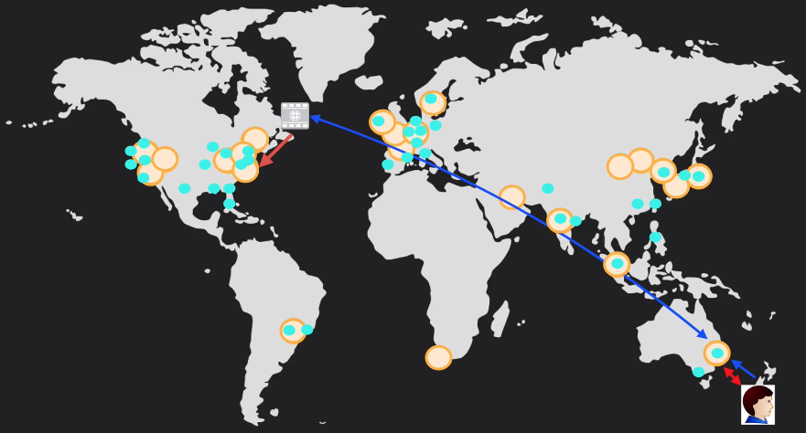

- __What are 5 things that can serve as a CloudFront "origin" (the location of where the original data is stored)?__ (6:55)
  - s3 bucket
  - EC2 instance (that may have a web server)
  - Elastic Load Balancer (that may front an EC2 instance or Route53 endpoint)
  - Route 53 endpoint
  - An external system.
- __What is an edge location?__ (7:35) the location your content will be cached
- __How long does data stay in an edge location?__ (7:50) the data expires after a default Time To Live (TTL) of 24 hours, and then is removed. This ensures the data is never too out of date.
- __Can you remove objects from the edge location?__ (8:00) Yes, you can remove (invalidate) them before the TTL, but you will be charged. This is useful if you need to put more up-to-date data into the edge location.
- __Does CloudFront support static (such as images) or dynamic content (such as Java code, Ruby, Python)?__ (8:25) It supports both.
- __What are 2 types of CloudFront distributions?__  (8:55)
  - Web distributions - used for websites
  - RTMP - Used for media streaming

### Transfer Acceleration

- __What is "S3 Transfer Acceleration"?__ (2:20) It uses AWS Edge Locations to speed up GETS and PUTS for objects in your bucket. As data arrives at an AWS Edge Location, it is routed to your S3 bucket over an optimized network path (that is faster than the internet)
- __If a user in New Zealand wants to upload data to Virginia, what's different in the network if S3 Transfer Acceleration is used?__ (3:40)

Without S3 Transfer Acceleration, a user uploads their object through the _internet_ to a bucket in Virginia (blue arrow):


With S3 Transfer Accleration, the user only uses the _internet_ to upload their object to the edge location in Sydney (blue arrow). Then S3 Transfer Acceleration is going to use an optimized network path to upload it to s3 bucket in Virginia (big red arrow):


- __Is S3 Transfer Acceleration same as CloudFront?__ (5:00) No. It's not CloudFront. It just uses the CloudFront network of edge locations. There is no caching, and we're not creating a CloudFront distribution.
- __Is transfer acceleration free?__ (5:55) No.
- __After enabling transfer acceleration, how do you use it?__ (6:00) You're given a new (URL) endpoint that you can use for transfer accelerated GET/PUT requests.

### Optimizing S3 PUTS, GETS, & LISTS

- __Other than parallelization, what's another benefit for multi-part uploads?__ (1:50) Increased resiliency: If you get a network error, you only need to re-upload the parts that fail
- __What's the best way to know how many parts to break a file into before uploading?__ (2:30)
  - As a rule of thumb, use 25-50MB on higher bandwidth networks, 10MB on mobile networks
  -  Try different sizes, and see what works best.

### Multipart Upload Lab

- __Is multi-part upload done by default in CLI?__ (1:10) Yes! For objects larger than 8 MB in size, it splits them into 8 MB chunks and uploads them in parallel.


# Chapter 9 - Website Hosting

### Static Website Hosting

[Detailed documentation I found online](https://docs.aws.amazon.com/AmazonS3/latest/dev/website-hosting-custom-domain-walkthrough.html)

- __What are examples of static content?__ (0:35) client side content such as HTML, CSS, Javascript.
- __What are examples of dynamic content?__ (0:45) ruby, java, php.
- __How can you make a serverless DYNAMIC website with s3?__ (1:45) Static content on s3. API Gateway will call Lambda functions for dynamic code.
- __URLs for buckets being used as websites are lengthy. What service can you use to get custom domain names?__ (3:20) Route53. Can point the domain root to the S3 bucket.
- __How can you have HTTPS work on static website?__ (6:00) Put CloudFront in front of website. Users will connect to CloudFront using https, and CloudFront will talk to the s3 website using HTTP.
- __How get both `website.com` and `www.website.com` to work with static website (in the browser)?__ (7:47) Use a bucket level redirect. Practical example shown at [Static Website Created Resources](static-website-created-resources)

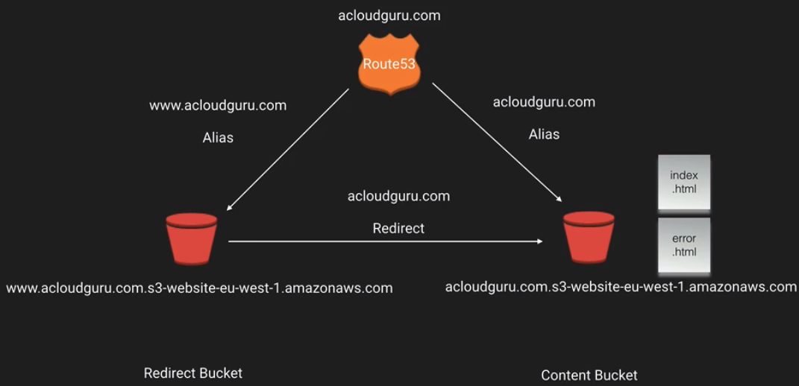

- Documentation I found online
  - [Create s3 static website with custom domain name](https://docs.aws.amazon.com/AmazonS3/latest/dev/website-hosting-custom-domain-walkthrough.html)
  - [Add HTTPS to s3 static website, by using CloudFront](https://aws.amazon.com/premiumsupport/knowledge-center/cloudfront-https-requests-s3)
    - [Advanced: Forcing users to use CloudFront (so it's HTTPS) instead of s3 bucket](https://acloud.guru/forums/s3-masterclass/discussion/-LtK5FV6C5-6g84wrRKp/what_is_best_to_secure_an_s3_s)

### Static Website Hosting Lab

- __How create redirect from 1 webpage to another?__ (7:45) in s3 console under "Static Website Hosting", we can write custom XML code for redirects.

### Cross-Origin Resource Sharing (CORS) Lab

- __What is CORS?__ (0:15) Defines a way for web apps that are loaded in one domain to access resources in another domain. These types of requests are blocked by default by the browser (as a security measure to prevent the loading of web resources without the owner's consent)

### Cross-Origin Resource Sharing (CORS) Lab

- __How do you enable CORS for s3 bucket, to allow a specific URL to get resources from this bucket?__ (10:15) Simple, use a bucket policy. Go to s3 bucket that we're trying to get data from, click Permissions -> CORS, and add a bucket policy that has the URL that you will allow to access your resources.

# Custom Static Website Creation

This section is not from the tutorial.

1. I purchased `edgarshaghoulian.com` from Route 53.
1. I created an s3 bucket called `edgarshaghoulian.com`
1. I created an s3 bucket called `www.edgarshaghoulian.com`
1. I created a bucket level redirect from `www.edgarshaghoulian.com` to  `edgarshaghoulian.com`
1. For Route 53 domain name of edgarshaghoulian.com, I created 2 aliases, one for `edgarshaghoulian.com`, and one for `www.edgarshaghoulian.com`

The below images show the resources that were created for [www.edgarshaghoulian.com](http://www.edgarshaghoulian.com)

### 1. s3 Buckets

Go to s3 to see buckets `edgarshaghoulian.com` and `www.edgarshaghoulian.com`

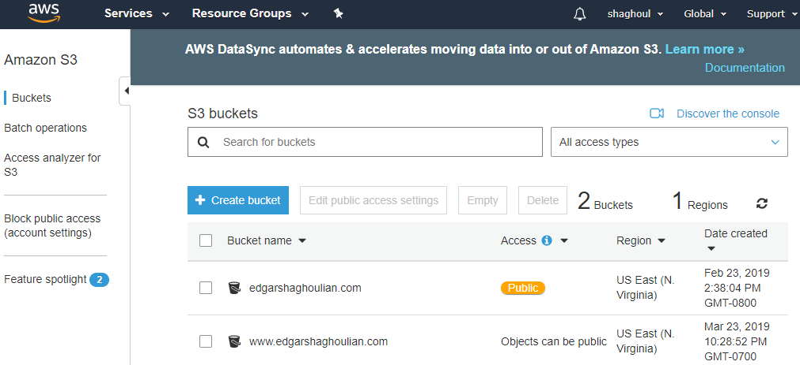

### 2. Hosted Zones

Go to Route 53. Click "Hosted Zones" to see `edgarshaghoulian.com` and `www.edgarshaghoulian.com`

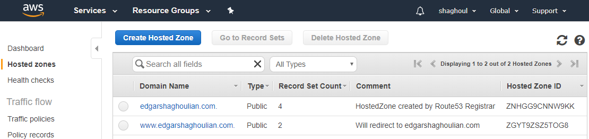

### 3. Hosted Zone Records

Click `edgarshaghoulian.com`, and click "Go to Record Sets" to open the 4 "Records"

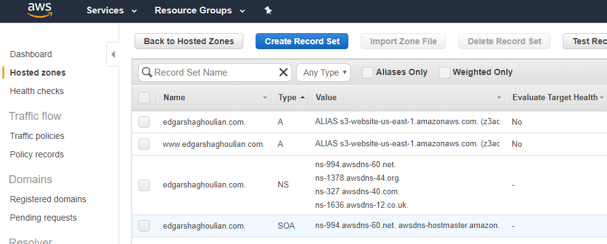

### 4. Alias with WWW

Click on record that has `Name = edgarshaghoulian.com` and `Type = A`. On the right side of the screen, "Edit Record Set" with "Alias Target" will show up on the right side of the screen.

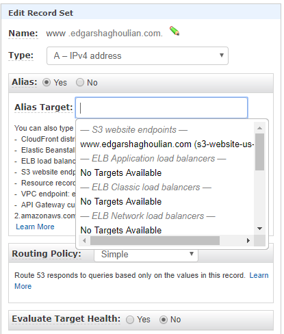

### 5. Alias without WWW

Click on record that has `Name = www.edgarshaghoulian.com` and `Type = A`. On the right side of the screen, "Edit Record Set" with "Alias Target" will show up.

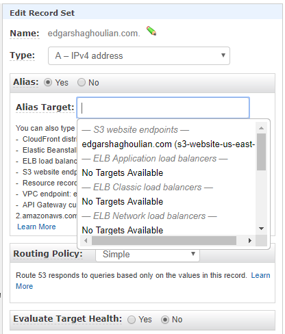


# References

- Repo is based on [S3 Masterclass](https://acloud.guru/learn/aws-lambda) tutorial by "A Cloud Guru" - an amazing course.
  - The encryption part of this course was excellent!
  - Skip chapter 10 since it just shows how to use a specific non-AWS tool (CloudBerry).
